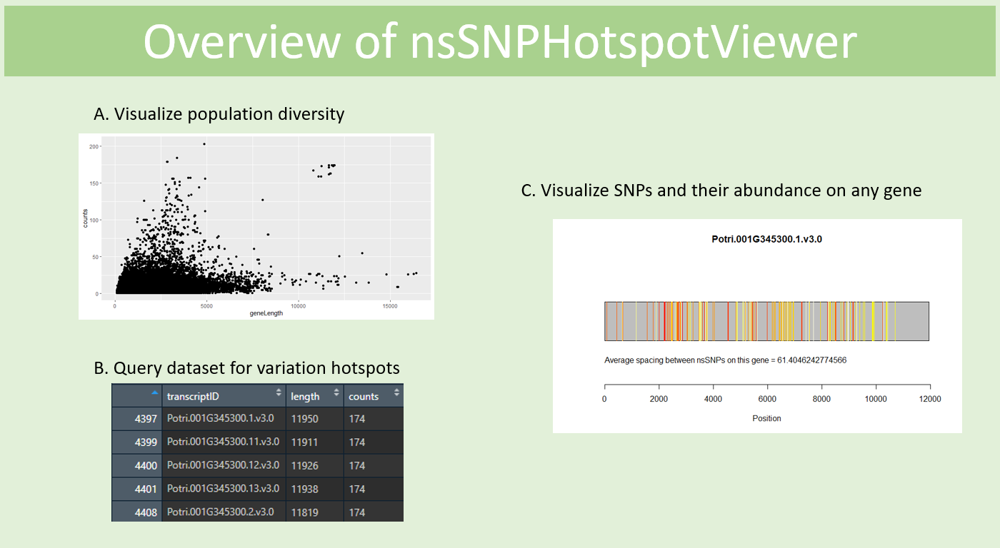

<!-- README.md is generated from README.Rmd. Please edit that file -->

# nsSNPHotspotViewer

<!-- badges: start -->

<!-- badges: end -->

## Description

The goal of nsSNPHotspotViewer is to provide a simple way to
qualitatively assess the degree of genetic variation found in population
data, and visualize genes of high mutation activity, which may be
indicative of functional importance in response to selective pressures.

The package acts on a dataset that was obtained by parsing annotated
genomic data (stored in VCF files). From these VCFs, the dataset
contains lists of all single-base missense mutations (non-synonymous
SNPs) for each gene. From this data, one can gain insight on the
relative functional importance of genes by observing their degree of
genetic variability – functionally important genes may have the same
SNPs occurring at higher rates across the population. Ultimately, while
also obtaining candidate genes for laboratory experimentation to
determine function, this package also provides simple graphical
descriptions of their level of genetic variation.

## Installation

To download the package:

    require("devtools")
    devtools::install_github("LZhang98/nsSNPHotspotViewer", build_vignettes=TRUE)
    library("nsSNPHotspotViewer")

To run the shinyApp:

    Under construction.

## Overview

    ls("package:nsSNPHotspotViewer")
    data(package="nsSNPHotspotViewer")

`nsSNPHotspotViewer` contains 6 functions that combine to visualize
genetic variation in genes across the population. *calculateMeanSpacing*
computes the average number of bases between adjacent SNPs on each gene.
*getSNPCounts* counts the total number of SNPs (or unique SNP positions)
found on each gene. *plotPopulation* produces a scatterplot that
summarizes the number of SNPs on each gene against gene length to help
query the dataset. *queryCounts* returns a subset of the dataset based
on user input parameters, and sorts the remaining hits. Finally
*initializeGene* and *visualizeGene* combine to output a single gene in
graphical format. To see how these methods function together in more
detail, use `browseVignettes("nsSNPHotspotViewer")`.

A pictoral overview of the package workflow is given below:

## Contributions

The author of the package is Luke Zhang. *plotPopulation* uses the
`ggplot2` R package’s graphical output. *visualizeGene* uses the
`graphics` R package to produce the visualization. The `snpPositions`
dataset was produced in an external Python script by the author. All
other components of the package were written by the author in R.

## References

McKown A, Klapste J, Guy R, Geraldes A, I Prth, et al (2014).
Genome‐wide association implicates numerous genes underlying
ecological trait variation in natural populations of Populus
trichocarpa. *New Phytologist*, vol 203 .
<https://doi.org/10.1111/nph.12815>.

R Core Team (2020). R: A language and environment for statistical
computing. R Foundation for Statistical Computing, Vienna, Austria.
<https://www.R-project.org/>.

Wickham, H. (2016). ggplot2: Elegant Graphics for Data Analysis.
Springer-Verlag New York. <https://ggplot2.tidyverse.org/>.

Wickham, H. and Bryan, J. (2019). *R Packages* (2nd edition). Newton,
Massachusetts: O’Reilly Media. <https://r-pkgs.org/>

## Acknowledgements

This package was developed as part of an assessment for 2020 BCB410H:
Applied Bioinformatics, University of Toronto, Toronto, CANADA.
