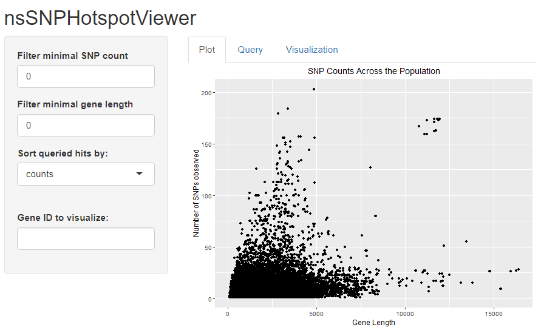
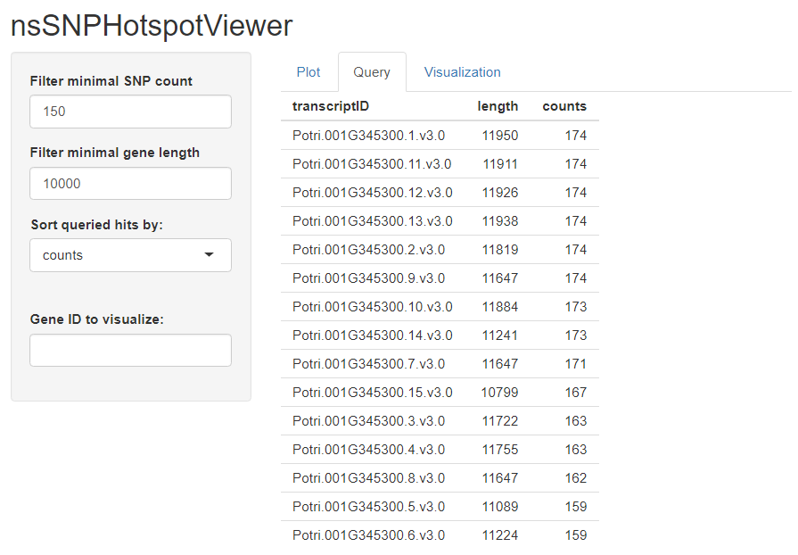
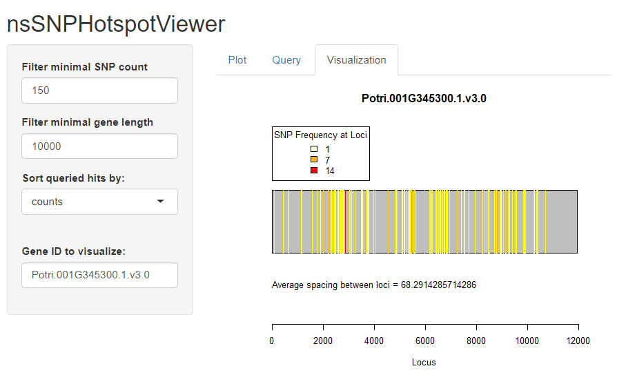

```{r, include = FALSE}
knitr::opts_chunk$set(
  collapse = TRUE,
  comment = "#>"
)
```

```{r setup}
library(nsSNPHotspotViewer)
```

## Navigating the Shiny app

To demonstrate the utility of the Shiny app, this vignette briefly goes over its principal components and how they fit together to provide accessible to the user.

To run the Shiny app, execute the following in the R console:
```
runViewer()
```

The user will be greeted with this window (give the plot a couple seconds to load in):



The side panel provides the user with 4 fields. We will focus on the first 3 for now. These fields control the output of the second Query tab.

\itemize{
    \item Filter minimal SNP count: provide a minimal number of observed SNPs for the Query results
    \item Filter minimal gene length: provide a minimal gene length for the Query results
    \item Sort queried hits by: a dropdown menu that allows the user to control how the results are sorted, in decreasing order
}

As an example, enter 150 into the first field, 10000 into the second, and leave `counts` as the selection in the dropdown menu. This will trigger a reactive section of the Shiny app to run the underlying `queryCounts()` function based on given user parameters. Switch to the Query tab to view these results:



From here, we can copy-paste the transcriptID of our choosing to see what its level of genetic variation looks like. Copy-paste the very top hit, `Potri.001G345300.1.v3.0`, into the **Gene ID to visualize** field, and switch to the Visualization tab. The result is the following:



From this illustration, we easily see that this transcript contains a potential functionally important region at around locus 2000, as indicated by its low line-spacing and presence of red lines. These regions of especially high variation may be a sign of response to selective pressures, and are potential candidate regions for downstream laboratory experimentation.

## References

McKown A, Klapste J, Guy R, Geraldes A, I Prth, et al (2014). Genome‐wide association implicates numerous genes underlying ecological trait variation in natural populations of Populus trichocarpa. *New Phytologist*, vol 203 . https://doi.org/10.1111/nph.12815.

Winston Chang, Joe Cheng, JJ Allaire, Yihui Xie and Jonathan McPherson (2020). shiny: Web
  Application Framework for R. R package version 1.5.0. https://CRAN.R-project.org/package=shiny

